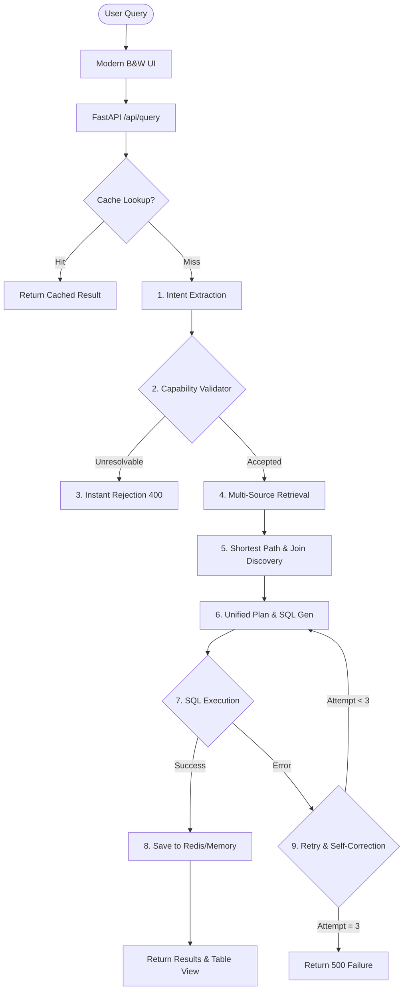

# Talk to Data: End-to-End Query Processing Pipeline

This guide outlines the detailed, step-by-step workflow of the **Talk to Data** query execution engine. Use this workflow document to understand and explain how the system translates natural language queries into safe, highly relevant SQL queries, including the newly introduced 3-tier Capability Validation Layer and UI redesign.

---

## 1. High-Level Architecture Flow

---

## 2. Phase-by-Phase Workflow Breakdown

### Phase 1: User Request & Sanitization
1. **Query Input**: The user enters a query via the redesigned monochrome UI (e.g., using interactive quick-start suggestion cards or the main search bar).
2. **API Endpoint (`/api/query`)**:
   - The query is sanitized (whitespace trimmed, normalized to lowercase).
   - A SHA-256 hash is generated to uniquely identify the query payload.
3. **Dual-Tier Cache Lookup**:
   - **Redis Cache (Tier 1)**: First checks the Redis cache (`redis://127.0.0.1:6379/0`) for matching queries.
   - **Local Memory Cache (Tier 2)**: If Redis is offline or disconnected, checks an in-memory dictionary.
   - *If cache hits*, returns the payload immediately with `cached: true` (sub-millisecond response).

---

### Phase 2: Intent Extraction
*Responsible: [IntentExtractor](file:///d:/Retrival/app/core/intent_extractor.py)*
1. The raw user query is sent to the LLM (`gemma4:31b-cloud` via Ollama).
2. The LLM extracts intent fields structured into a JSON payload:
   - **Entities**: Business objects (e.g., `Customer`, `Bike`)
   - **Metrics**: Calculated fields (e.g., `revenue`, `profit margin`)
   - **Filters**: Conditional criteria (e.g., `London`, `2023`)
   - **Dimensions**: Grouping criteria (e.g., `color`, `category`)

---

### Phase 3: Three-Tier Capability Validation (New)
*Responsible: [CapabilityValidator](file:///d:/Retrival/app/core/capability_validator.py)*
This layer acts as a gatekeeper before executing expensive context retrieval or LLM calls. It classifies extracted intent concepts into `MATCHED`, `DERIVABLE`, or `UNRESOLVABLE`:

1. **Tier 1: Catalogue Rule Match**:
   - Checks if the concept matches business rules or formulas defined in `field_catalogue2.json`.
   - Verifies if the physical columns required for the formula actually exist in the database (queried from the SQLite Info DB).
   - If they exist, the concept is marked as `DERIVABLE`.
2. **Tier 2: Schema Metadata Match**:
   - Checks table names, column names, and categorical column values in the `info.db` SQLite metastore.
   - Matches can be exact or fuzzy (using SQL `LIKE` queries). If found, the concept is marked as `MATCHED`.
3. **Tier 3: Ontology Synonym Match**:
   - Checks Neo4j for `Synonym` or `Concept` nodes mapping to physical tables.
   - Resolves synonyms (e.g., "buyer" to `Customer` table). If found, marked as `MATCHED`.
4. **Gatekeeping Decision**:
   - If any concept remains `UNRESOLVABLE` (e.g., trying to query AdventureWorks columns like "bike color" on the Northwind database), the request is **instantly rejected** with a HTTP `400 Bad Request` explaining exactly which fields are missing.

---

### Phase 4: Parallel Context Retrieval
*Responsible: [ContextRetriever](file:///d:/Retrival/app/core/retriever.py)*
If the query passes validation, the system retrieves only the schema context relevant to the query to fit within Ollama's context window and reduce tokens:

1. **Parallel Execution**: Uses a Python `ThreadPoolExecutor` to run search queries concurrently:
   - Resolve entity concepts to table names using Neo4j ontology.
   - Vector search table/column descriptions and categorical values using ChromaDB.
   - Query Info DB `meta_values` for precise categorical string matching (e.g., matching the filter "London" to `Customers.City`).
   - Deep‑resolve metrics and dimensions using Vector lookup.
2. **Deduplication**: Aggregates and dedupes all target tables and column mappings.

---

### Phase 5: Multi-Hop Join Reasoning
*Responsible: [ContextRetriever](file:///d:/Retrival/app/core/retriever.py)*
If the context requires columns from multiple tables:
1. **Shortest Path Discovery**: Executes a Neo4j Cypher query to find the shortest path of `REFERENCES_TABLE` relationships connecting the target tables. This automatically adds any bridge/junction tables (e.g., linking `Customers` and `Products` via `Orders` and `OrderDetails`).
2. **Join Detail Generation**: Retrieves specific foreign key mapping expressions (`TableA.ColA = TableB.ColB`) and detects structural constraints (e.g., Detail-to-Header constraints to alert the LLM not to sum header columns directly).
3. **DDL Building**: Reads SQLite schema metadata from Info DB to generate a compact, minimized DDL context (with 1 row of sample data for the target tables).

---

### Phase 6: Plan & SQL Generation
*Responsible: [SQLGenerator](file:///d:/Retrival/app/core/generator.py)*
1. **Unified Prompt**: Combines the extracted intent, minimized DDL schema, value mappings, and join paths into a structured instruction prompt.
2. **CoT Plan & SQL Synthesis**:
   - The LLM reasons step-by-step to generate a **structured plan** (describing tables, joins, filters, and aggregations) and the **SQL query**.
3. **Safety Verification**:
   - Runs a regex safety check to reject queries containing modification operators (`DROP`, `DELETE`, `UPDATE`, `INSERT`, `ALTER`, etc.).

---

### Phase 7: Self-Correction Loop & Database Execution
1. **Database Execution**: Runs the generated query on the target database engine.
2. **Iterative Error Correction**:
   - If execution fails (e.g., syntax error, table not found), the generator catches the SQL exception.
   - The generator passes the error message, the failed SQL, and the existing plan back to the LLM to correct the query.
   - Retries up to **3 times**.
3. **Persistence**:
   - Upon successful execution, the query results are cached.
   - Results are converted to JSON and returned to the UI alongside the execution plan, SQL query, and field mappings.
